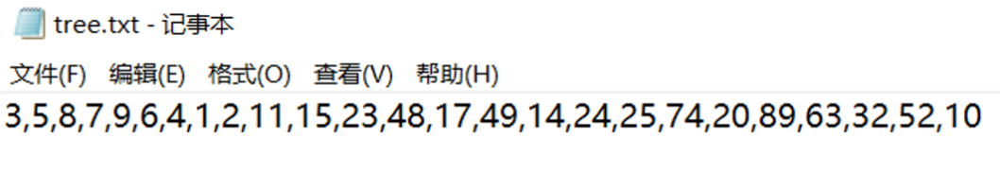
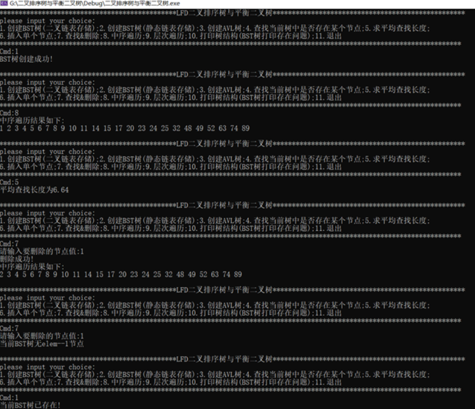
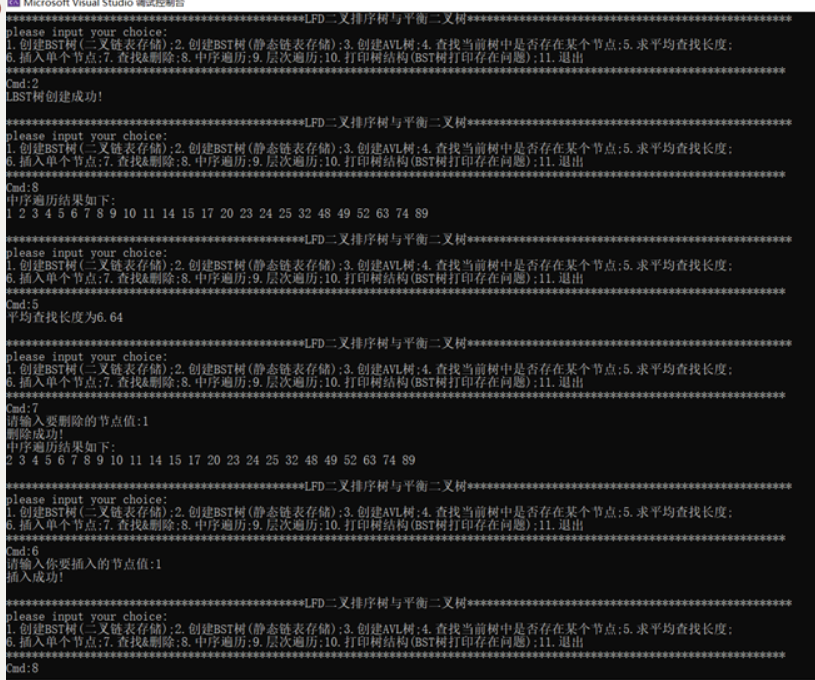
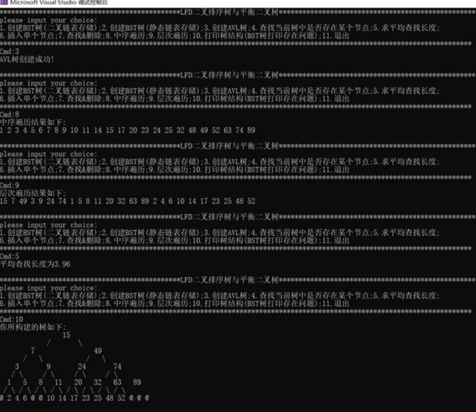
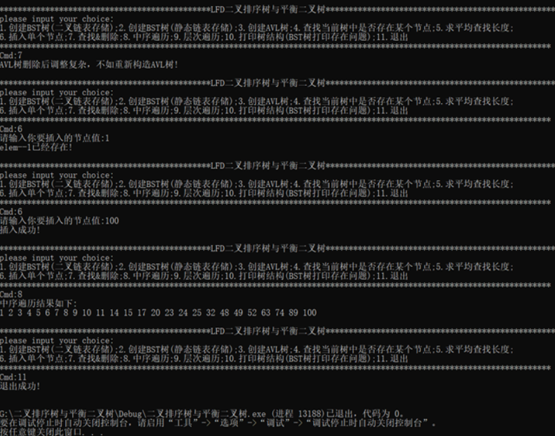

# 二叉排序树与平衡二叉树

## 1.问题重述

分别采用二叉链表和顺序表作存储结构，实现对二叉排序树与平衡二叉树的操作。

**(1)用二叉链表作存储结构实现二叉排序树。**

1)以回车符(‘\n’)为输入结束标志，输入数列L，生成一棵二叉排树T；

2)对二叉排序树T作中序遍历，输出结果；

3)计算二叉排序树T查找成功的平均查找长度，输出结果；

4)输入元素x，查找二叉排序树T，若存在含x的结点，则删除该结 点，并作中序遍历(执行操作2)；否则，输出信息“无x”；

**(2)用顺序表(一维数组)作存储结构----静态链表**

1)以回车符(‘\n’)为输入结束标志，输入数列L，生成一棵二叉排序 树T；

2)对二叉排序树T作中序遍历，输出结果；

3)计算二叉排序树T查找成功的平均查找长度，输出结果；

4)输入元素x，查找二叉排序树T，若存在含x的结点，则删除该结点，并作中序遍历(执行操作2)；否则，输出信息“无x”；

**(3)用二叉链表作存储结构实平衡的二叉排序树。**

1)用数列L，生成平衡的二叉排序树BT：当插入新元素之后，发现 当前的二叉排序树BT不是平衡的二叉排序树，则立即将它转换成新的平 衡的二叉排序树BT；

2)计算平衡的二叉排序树BT的平均查找长度，输出结果。

**拓展:增加了AVL树的打印函数，直观展现树形结构；设置了简单的交互界面，便于操作。**


## 2.代码实现

```c++
#define _CRT_SECURE_NO_WARNINGS

#include<stdio.h>
#include<stdlib.h>
#include<string.h>
#include<math.h>
#include<Windows.h>

//界面设置
const int N = 300;

//数据类型
#define Elemtype int

//队列
#define Ptrtype BSTptr
#define MAXNODE 100

//静态链表
#define MAXLENGTH 100
#define null -858993460

//状态变量
typedef int Status;
#define TRUE 1
#define FALSE 0
#define OK 1
#define ERROR 0

//BST与AVL公用结构
typedef struct Node {
    Elemtype elem;
    struct Node* Lch;
    struct Node* Rch;
    int height;
}BST, * BSTptr;

//LBST静态链表
typedef struct {
    Elemtype data;
    int Lch, Rch;
}LBST[MAXLENGTH];


//队列结构
typedef struct QNode {
    Ptrtype ptr;
    struct Node* next;
}QNode, * Queueptr;       //采用二重指针，便于修改

typedef struct {
    Queueptr front;
    Queueptr rear;
}Queue;

//链栈
//typedef struct Node{
//    int data;
//    struct Node* pNext;
//}NODE,*PNODE;
//
//typedef struct STACK{
//    PNODE pTop;
//    PNODE pBottom;
//}STACK,*PSTACK;

//BST树的创建
Status Search(BSTptr T, Elemtype elem, BSTptr Parent, BSTptr* p);//查找
BSTptr Init_Node(Elemtype elem);         //初始化一个节点
Status Insert(BSTptr* T, Elemtype elem);

//遍历相关操作
Status Inorder_Recursion(BSTptr T);      //中序遍历递归算法；递归不用栈，原因是递归函数本身就是用栈来调用
//Status Inorder_NonRecursion(BSTptr T); //中序遍历非递归算法
Status Levelorder(BSTptr T);             //层次遍历
Status Visit(BSTptr T);                  //访问节点值
Elemtype MAXElem(BSTptr T);              //得到最大值
Elemtype MINElem(BSTptr T);              //得到最大值

//AVL树相关操作
int Judge_layer(BSTptr T, Elemtype elem);             //判断elem节点的层数，并返回
BSTptr Bulid_AVL(BSTptr T, Elemtype elem);            //判断一个BST书是否为AVL树
BSTptr LL_Rotate(BSTptr T);
BSTptr RL_Rotate(BSTptr T);
BSTptr LR_Rotate(BSTptr T);
BSTptr RR_Rotate(BSTptr T);
int GetHeight(BSTptr T);
int Max(int a, int b);

//删除操作
BSTptr Delete(BSTptr T,BSTptr p,BSTptr parent);
BSTptr Get_Delete_Node_And_Parent(BSTptr T, Elemtype elem,BSTptr* parent);  //让其父节点以指针形式返回

//打印树结构
void Screen_Reveal(BSTptr T);

//LBST相关操作
int creat_LBST(LBST t, Elemtype* L, int len);
int insert_LBST(LBST t, Elemtype elem,int len);
Status visit_LBST(int R, LBST t);
float Search_Success_Average_LBST(LBST T, Elemtype* L, int count);
int Search_LBST(LBST T, Elemtype data);
Status Delete_LBST(LBST T, int p, int parent);
int Get_LBST_Node_And_Parent(LBST T, Elemtype data, int* parent);

////栈的操作
//void Stack_Init(PSTACK);//初始化栈
//void Stack_Push(PSTACK, BSTptr* T);
//int Stack_Empty(PSTACK);
//void Stack_Pop(PSTACK, BSTptr* T);


//队列操作
Status InitQueue(Queue* q);
Status EnQueue(Queue* q, Ptrtype ptr);
Ptrtype DeQueue(Queue* q);                   //出队
//Status PrintQueue(Queue q);                //由于当前队列存放均为指针，不需要打印

//文件处理
int Open_File(Elemtype L[]);     //将打开的文件存放在数组L中->L也可以构建成一个链表
Elemtype Convert(char* str);    //将文本中的字符变量变成Elemtype型（int)

//测试函数
Status Test(void);
Status Test2(void);
Status Test3(void);

//运行函数
Status Run_process(void);
Status Command(void);


int main()
{
    Run_process();
    //Test();
    //Test2();
    //Test3();
    //Test4();
    return 0;
}


Status Run_process(void)
{
    system("mode con cols=300"); //控制台每行最多输出300

    //变量定义
    BSTptr tree = NULL;   //二叉链表
    LBST Ltree;           //静态链表
    BSTptr p;             //BST临时变量
    BSTptr parent;        //BSTdelete操作使用
    int P;                //LBST临时变量
    int Parent;           //LBSTdelete操作使用
    int choice;           //选择命令
    int elem;             //elem临时变量
    int flag = 1;         //调节是否退出
    int tag = 0;          //标记是树的种类
    //int L[20];//连续插入最大可插入20个
    Elemtype L[MAXNODE];  //数据缓冲区
    int count = 0;        //计数器，表示文件中的数字数量
    int layer;            //判断层次
    int sum = 0;          //求平均层次时用
    //char ch[50];        //连续插入控制符


    while (flag) {
        Command();
        (void)scanf("%d", &choice);
        while (choice < 1 || choice>11) {
            printf("please input proper Cmd!\nCmd:");
            (void)scanf("%d", &choice);
        }
        switch (choice) {
        case 1:
            if (tag == 1) {
                printf("当前BST树已存在!");
                break;
            }
            tree = NULL;
            count = Open_File(L);
            for (int j = 0; j < count; j++) {
                Insert(&tree, L[j]);
            }
            printf("BST树创建成功!");
            tag = 1;
            break;
        case 2:
            if (tag == 2) {
                printf("当前LBST树已存在!");
                break;
            }
            count = Open_File(L);
            count=creat_LBST(Ltree, L, count);  //L中可能存在相同元素，需要重新统计count
            printf("LBST树创建成功!");
            tag = 2;
            break;
        case 3:
            if (tag == 3) {
                printf("当前AVL树已存在!");
                break;
            }
            tree = NULL;
            count = Open_File(L);
            for (int j = 0; j < count; j++) {
                tree = Bulid_AVL(tree, L[j]);
            }
            printf("AVL树创建成功!");
            tag = 3;
            break;
        case 4:
            if (tag == 0) {
                printf("请先构造BST，LBST或者AVL树!\n");
                break;
            }
            else {
                printf("请输入要查找的值:");
                scanf_s("%d", &elem);
                if (tag != 2) {
                    if (Search(tree, elem, NULL, &p) == TRUE) {
                        printf("当前树中存在该节点，并且其位于%d层!", Judge_layer(tree, p->elem));
                    }
                    else {
                        printf("当前树中没有该节点!");
                    }
                }//tag!=2
                else {//tag==2->LBST
                    layer = Search_LBST(Ltree, elem);
                    layer == -1 ? printf("当前树中没有该节点!") : printf("当前树中存在该节点，并且其位于%d层!", layer);
                }

            }
            break;
        case 5:
            if (tag == 0) {
                printf("请先构造BST,LBST或者AVL树!\n");
                break;
            }
            if (tag != 2) {
                for (int i = 0; i < count; i++) {
                    layer = Judge_layer(tree, L[i]);
                    //if (layer == -1) {
                    //    //若无该节点，跳过输出
                    //    printf("无%d节点\n", L[i]);
                    //    continue;
                    //}
                    sum += layer;
                }
                count==0?printf("当前树中没有元素!"):printf("平均查找长度为%.2f", (float)sum / (float)count);
            }//tag!=2
            else {
                count==0?printf("当前树中没有元素!"):printf("平均查找长度为%.2f", Search_Success_Average_LBST(Ltree, L, count));
            }
            sum = 0;
            break;
        case 6:
            if (tag == 0) {
                printf("请先构造BST,LBST或者AVL树!\n");
                break;
            }
            printf("请输入你要插入的节点值:");
            scanf_s("%d", &elem);
            if (tag == 2) {//LBST
                if (count == N) {
                    printf("当前LBST已满，无法插入!");
                    break;
                }
                count++;
                (insert_LBST(Ltree, elem, count) == 1) ? printf("当前LBST树已存在elem--%d节点!", elem) : printf("插入成功!");
            }

            else {
                if (Judge_layer(tree, elem) != -1) {
                    //说明当前树中存在elem
                    printf("elem--%d已经存在!", elem);
                }
                else {
                    count++;
                    L[count - 1] = elem;
                    if (tag == 1) {
                        Insert(&tree, L[count - 1]);
                    }//BST
                    else {
                        tree = Bulid_AVL(tree, L[count - 1]);
                    }//AVL
                    printf("插入成功!");
                }
            }
            break;
        case 7:
            if (tag == 3) {
                printf("AVL树删除后调整复杂，不如重新构造AVL树!");
                break;
            }
            if (tag == 0) {
                printf("请先构造BST或者LBST树!\n");
                break;
            }
            printf("请输入要删除的节点值:");
            scanf_s("%d", &elem);
            //BST二叉链表形式
            if (tag == 1) {
                p = Get_Delete_Node_And_Parent(tree, elem, &parent);
                if (p == NULL) {
                    printf("当前BST树无elem--%d节点", elem);
                }
                else {
                    tree = Delete(tree, p, parent);
                    printf("删除成功!\n中序遍历结果如下:\n");
                    Inorder_Recursion(tree);
                }
            }

            //LBST静态数组表示
            if (tag == 2) {
                P = Get_LBST_Node_And_Parent(Ltree, elem, &Parent);
                if (P == null) {
                    printf("当前BST树无elem--%d节点", elem);
                }
                else {
                    Delete_LBST(Ltree, P, Parent);
                    printf("删除成功!\n中序遍历结果如下:\n");
                    Ltree[0].data==null?printf(" "):visit_LBST(0, Ltree);
                }
            }
            break;
        case 8:
            if (tag == 0) {
                printf("请先构造BST，LBST或者AVL树!\n");
                break;
            }
            printf("中序遍历结果如下:\n");
            if (tag == 1||tag==3) {
                Inorder_Recursion(tree);
            }
            else {
                if (Ltree[0].data == null) {
                    printf(" ");
                }
                else {
                    visit_LBST(0, Ltree);
                }
            }
            //tag == 2 ? (Ltree[0].data==null?printf(" "):visit_LBST(0, Ltree)) : Inorder_Recursion(tree);
            break;
        case 9:
            if (tag == 0) {
                printf("请先构造BST或者AVL树!\n");
                break;
            }
            if (tag == 2) {
                printf("尚未开发LBST树的层次遍历!");
                break;
            }
            printf("层次遍历结果如下:\n");
            Levelorder(tree);
            break;
        case 10:
            if (tag == 0) {
                printf("请先创建AVL树!");
                break;
            }
            if (tag == 1 || tag == 2) {
                printf("BST树与LBST树暂且未开发打印功能,打印功能仅适用AVL树!");
                break;
            }
            printf("你所构建的树如下:\n");
            if (count == 0) {
                //AVL树中没有元素，直接打印空
                printf("  @");
            }
            else if (count == 1) {
                //AVL树中仅有一个元素，打印唯一
                printf("   %d\n  / \\\n @   @", tree->elem);
            }
            else {
                //AVL树中至少含有两个元素
                Screen_Reveal(tree);
            }
            break;
        case 11:
            flag = 0;
            printf("退出成功!");
            break;
        default:
            break;
        }//switch
        printf("\n\n"); //格式调整
    }//while flag

    return OK;
}


Status Test(void)
{
    Elemtype L[100];
    for (int i = 1; i <= 100; i++) {
        L[i - 1] = i;
    }
    BSTptr tree = NULL;
    int layer;
    int sum = 0;
    system("mode con cols=100");//每行最大100
    for (int i = 0; i < 100; i++) {
        tree = Bulid_AVL(tree, L[i]);
    }
    //printf("中序遍历结果如下:\n");
    //Inorder_Recursion(tree);
    //printf("\n");
    Screen_Reveal(tree);
    //Levelorder(tree);
    //printf("\n%d", GetHeight(tree));
    //Elemtype g[3] = { 1,2,3 };
    //for (int i = 0; i < 3; i++) {
    //    layer = Judge_layer(tree, g[i]);
    //    if (layer == -1) {
    //        //若无该节点，跳过输出
    //        printf("无%d节点\n", g[i]);
    //        continue;
    //    }
    //    printf("%d节点在第%d层\n", g[i], layer);
    //    sum += layer;
    //}

    //printf("LR旋转后：\n");
    //tree=LR_Rotate(tree);
    //for (int i = 0; i < 7; i++) {
    //    layer = Judge_layer(tree, g[i]);
    //    if (layer == -1) {
    //        //若无该节点，跳过输出
    //        printf("无%d节点\n", g[i]);
    //        continue;
    //    }
    //    printf("%d节点在第%d层\n", g[i], layer);
    //    sum += layer;
    //}
    //printf("%d,%d", GetHeight(tree->Lch), GetHeight(tree->Rch));
   // printf("共查找%d次，平均查找长度为%d\n", sum,sum / 15);
   // //Inorder_NonRecursion(tree);
   // printf("MAX:%d\n", MAXElem(tree));
   // printf("MIN:%d\n", MINElem(tree));
   // system("pause");
   // return OK;
    //Elemtype g[6] = { 10,12,7,8,9,4 };
    //for (int i = 0; i < 6; i++) {
    //    layer = Judge_layer(tree, g[i]);
    //    if (layer == -1) {
    //        //若无该节点，跳过输出
    //        printf("无%d节点\n", g[i]);
    //        continue;
    //    }
    //    printf("%d节点在第%d层\n", g[i], layer);
    //    sum += layer;
    //}
    //printf("\n\n旋转后：\n");
    //LR_Rotate(&tree);
    //for (int i = 0; i < 6; i++) {
    //    layer = Judge_layer(tree, g[i]);
    //    if (layer == -1) {
    //        //若无该节点，跳过输出
    //        printf("无%d节点\n", g[i]);
    //        continue;
    //    }
    //    printf("%d节点在第%d层\n", g[i], layer);
    //    sum += layer;
    //}
    //printf("\n***%d", GetHeight(tree));
    //printf("共查找%d次，平均查找长度为%d\n", sum, sum / 15);
    //Inorder_NonRecursion(tree);
    //printf("MAX:%d\n", MAXElem(tree));
    //printf("MIN:%d\n", MINElem(tree));
    system("pause");
    return OK;
}

Status Test2(void) 
{
    LBST t;
    int L[5] = { 5,2,1,6,7 };
    int len = 5;

    creat_LBST(t, L, len);
    visit_LBST(0, t);
    float x = Search_Success_Average_LBST(t, L, len);
    printf("%.2f", x);
    return OK;
}

Status Test3(void)
{
    Elemtype L[10];
    for (int i = 1; i <= 10; i++) {
        L[i - 1] = i;
    }
    BSTptr tree = NULL;
    BSTptr parent = NULL;
    BSTptr p;
    for (int i = 0; i < 10; i++) {
        Insert(&tree, L[i]);
    }
    Inorder_Recursion(tree);
    printf("\n*********************\n");
    p=Get_Delete_Node_And_Parent(tree, 3, &parent);
    tree=Delete(tree, p, parent);
    Inorder_Recursion(tree);
    return OK;
}

Status Command(void)
{
    printf("**********************************************LFD二叉排序树与平衡二叉树**************************************************\n");
    printf("please input your choice:\n");
    printf("1.创建BST树(二叉链表存储);2.创建BST树(静态链表存储);3.创建AVL树;4.查找当前树中是否存在某个节点;5.求平均查找长度;\n6.插入单个节点;7.查找&删除;8.中序遍历;9.层次遍历;10.打印树结构(BST树打印存在问题);11.退出\n");
    printf("************************************************************************************************************************\n");
    printf("Cmd:");
    return OK;
}


BSTptr Init_Node(Elemtype elem) {
    //生成一个节点
    BSTptr p = (BSTptr*)malloc(sizeof(BST));
    if (p == NULL) {
        exit(0);
    }
    p->elem = elem;
    p->Lch = p->Rch = NULL;//左右子树置空
    return p;
}


Status Search(BSTptr T, Elemtype elem, BSTptr Parent, BSTptr* p)
{//采用递归进行查找，但不用记录路径,但需要记录其父节点，当p走到空时，让p回到parent，而且最后要返回p，所以使用二级指针
    if (T == NULL) {
        *p = Parent;
        return FALSE;
    }
    if (T->elem == elem) {//找到
        *p = T;
        return TRUE;
    }
    else if (T->elem > elem) {//去右子树查找
        return Search(T->Lch, elem, T, p);
    }
    else {//去左子树查找
        return Search(T->Rch, elem, T, p);
    }
}

Status Insert(BSTptr* T, Elemtype elem)
{
    if (*T == NULL) {
        *T = Init_Node(elem);
        return OK;
    }
    BSTptr p;
    if (Search(*T, elem, NULL, &p) == 0) {
        //查找当前树是否有elem值的节点，若没有，进行这一步
        BSTptr q = Init_Node(elem);//产生一个节点
        (elem < p->elem) ? (p->Lch = q) : (p->Rch = q);
    }
    else {
        printf("elem--%d节点已经存在!\n", elem);
    }
    return OK;
}

//
//void Inorder_NonRecursion(BSTptr T)
//{
//    BSTptr p = T;
//    PSTACK mystack;
//    Init(&mystack);
//    while (p && Stack_Empty(&mystack) == 0) {
//        if (p) {//一直向左走，并记录路径
//            Stack_Push(&mystack, p->Lch);
//            p = p->Lch;
//        }
//        else {//若走到左边尽头，弹出一个元素，访问然后开始访问右子树
//            Stack_Pop(&mystack, p);
//            Vist(p);
//            p = p->Rch;
//        }
//    }
//}

Status Inorder_Recursion(BSTptr T)//只用遍历，不用修改树的内容，所有不用使用指针的指针
{
    if (T == NULL) return FALSE;
    Inorder_Recursion(T->Lch);//中序遍历左子树
    Visit(T);                 //访问
    Inorder_Recursion(T->Rch);//中序遍历右子树
}

Status Levelorder(BSTptr T)
{
    Queue myqueue;
    BSTptr p;
    InitQueue(&myqueue);
    if (T) {
        EnQueue(&myqueue, T);
    }
    while (myqueue.front != myqueue.rear) {
        //队列不空
        p = DeQueue(&myqueue);
        Visit(p);
        if (p->Lch) {
            EnQueue(&myqueue, p->Lch);
        }
        if (p->Rch) {
            EnQueue(&myqueue, p->Rch);
        }
    }//while
    return OK;
}


Status Visit(BSTptr T)
{
    printf("%d ", T->elem);
    return OK;
    //如果为最大元素，去掉最后一个逗号
}

Elemtype MAXElem(BSTptr T)
{
    BSTptr p = T;
    while (p->Rch) p = p->Rch;
    return p->elem;
}

Elemtype MINElem(BSTptr T)
{
    while (T->Lch)T = T->Lch;
    return T->elem;
}

int Judge_layer(BSTptr T, Elemtype elem)
{
    int layer = 1;
    int tag = 0;
    BSTptr p = T;
    while (p) {
        if (p->elem == elem) {
            tag = 1;
            break;
        }
        else if (p->elem > elem) {
            p = p->Lch;
            layer++;
        }
        else {
            p = p->Rch;
            layer++;
        }
    }
    return (tag == 1 ? layer : -1);
}

BSTptr Bulid_AVL(BSTptr T, Elemtype elem)
{
    if (T == NULL) {
        T = (BSTptr*)malloc(sizeof(BST));
        (T)->elem = elem;
        (T)->height = 0;
        (T)->Lch = (T)->Rch = NULL;
    }
    else if (elem < (T)->elem) {
        (T)->Lch = Bulid_AVL((T)->Lch, elem);
        //printf("**%d**%d||", GetHeight(T->Lch), GetHeight(T->Rch));
        if (GetHeight(T->Lch) - GetHeight(T->Rch) == 2) {
            //L?旋转
            if (elem < (T)->Lch->elem) {
                T = LL_Rotate(T);
            }
            else {
                T = LR_Rotate(T);
            }
        }
    }
    else if (elem > (T)->elem) {
        (T)->Rch = Bulid_AVL((T)->Rch, elem);
        if (GetHeight(T->Lch) - GetHeight(T->Rch) == -2) {
            //R?旋转
            if (elem > (T)->Rch->elem) {
                T = RR_Rotate(T);
            }
            else {
                T = RL_Rotate(T);
            }
        }//if
    }//else if
    (T)->height = Max((T)->Lch, (T)->Rch) + 1;
    return T;
}

BSTptr LL_Rotate(BSTptr T) {
    //LL旋转
    BSTptr p = T;
    BSTptr q = (T)->Lch->Rch;
    T = (T)->Lch;
    (T)->Rch = p;
    p->Lch = q;
    return (T);
}

BSTptr LR_Rotate(BSTptr T) {
    //LR旋转
    BSTptr p = T;
    BSTptr q = (T)->Lch;
    T = (T)->Lch->Rch;
    p->Lch = (T)->Rch;
    q->Rch = (T)->Lch;
    (T)->Rch = p;
    (T)->Lch = q;
    return T;
}

BSTptr RL_Rotate(BSTptr T) {
    //RL旋转
    BSTptr p = T;
    BSTptr q = (T)->Rch;
    T = (T)->Rch->Lch;
    p->Rch = (T)->Lch;
    q->Lch = (T)->Rch;
    (T)->Lch = p;
    (T)->Rch = q;
    return T;
}


BSTptr RR_Rotate(BSTptr T) {
    //RR旋转
    BSTptr p = T;
    BSTptr q = (T)->Rch->Lch;
    T = (T)->Rch;
    (T)->Lch = p;
    p->Rch = q;
    return (T);
}
int GetHeight(BSTptr T)
{
    if (T == NULL) return 0;
    return Max(GetHeight(T->Lch), GetHeight(T->Rch)) + 1;
}
int Max(int a, int b)
{
    return a >= b ? a : b;
}
BSTptr Delete(BSTptr T,BSTptr p,BSTptr parent){
    //p为要删的节点，parent为其父节点
    BSTptr s, q;
    if (p->Lch == NULL) {
        s = p->Rch;
    }
    else if (p->Rch == NULL) {
        s = p->Lch;
    }
    else {//单独处理双孩子节点
        q = p;
        s = p->Lch;
        //找删除节点的直接后继
        while (s->Rch != NULL) {
            q = s;
            s = s->Rch;
        }
        if (p == q) {//没有执行上方循环
            q->Lch = s->Lch;
        }
        else {
            q->Rch = s->Lch;
        }
        p->elem = s->elem;
        free(s);
        return T;
    }
    if (parent == NULL) {
        parent = s;
    }
    else if (parent->Lch == p) {
        parent->Lch = s;
    }
    else {
        parent->Rch = s;
    }
    if (parent == NULL) {
        T = NULL;
    }
    free(p);
    return T;
}

BSTptr Get_Delete_Node_And_Parent(BSTptr T,Elemtype elem, BSTptr* parent)
{
    BSTptr p = T;
    *parent = NULL;
    int tag = 0;
    while (p != NULL) {
        if (elem < p->elem) {
            *parent = p;
            p = p->Lch;
        }
        else if(elem>p->elem){
            *parent = p;
            p = p->Rch;
        }
        else {
            tag = 1;//代表找到
            break;
        }
    }//while
    return tag == 1 ? p : NULL;
}
void Screen_Reveal(BSTptr T)
{
    int height = GetHeight(T);
    int h = height;
    int count = 0;//计数器
    Queue queue1;
    Queue queue2;                //完全二叉树的队列
    BSTptr p;
    InitQueue(&queue1);
    InitQueue(&queue2);
    if (T) {
        EnQueue(&queue1, T);
        EnQueue(&queue2, T);
    }
    while (queue1.front != queue1.rear) {
        //队列不空
        p = DeQueue(&queue1);
        if (p->Lch) {
            EnQueue(&queue1, p->Lch);
            EnQueue(&queue2, p->Lch);
        }
        if (p->Lch == NULL) {
            EnQueue(&queue2, NULL);
        }
        if (p->Rch) {
            EnQueue(&queue1, p->Rch);
            EnQueue(&queue2, p->Rch);
        }
        if (p->Rch == NULL) {
            EnQueue(&queue2, NULL);
        }
    }//while
    /*while (count < pow(2, height) - 1) {
        p = DeQueue(&queue2);
        if (p == NULL) {
            printf(" 空");
        }
        else {
            printf(" %d", p->elem);
        }
        count++;
    }*/

    //运行结束的queue2为一个完全二叉树指针的层次遍历
    printf(" ");
    for (int i = 0; i < height - 1; i++) {
        //按高度逐层打印,先不打印最后一层
        for (int k = 0; k < pow(2, h - 1) - 1; k++) {
            printf(" ");
        }
        for (int j = 0; j < pow(2, i); j++) {
            //打印每一层的pow(2,i)个节点
            //先打印pow(2,h-1)-1个空格

            p = DeQueue(&queue2);
            if (p == NULL) {
                printf("@");

            }
            else {
                printf("%d", p->elem);
            }

            if (i != 0) {
                for (int w = 0; w < ((pow(2, height) - 1) - (pow(2, height - (i + 1)) - 1) * 2 - pow(2, i)) / (pow(2, i) - 1); w++) {
                    printf(" ");
                }
            }


        }//j
        printf("\n ");
        //打印斜线
        if (h - 2 > 0) {
            for (int a = 0; a < (pow(2, h - 1) + pow(2, h - 2) - 2) / 2; a++) {
                printf(" ");
            }
            for (int c = 0; c < pow(2, i); c++) {
                printf("/");
                for (int b = 0; b < pow(2, h - 2) - 1; b++) {
                    printf(" ");
                }
                printf("\\");
                for (int v = 0; v < (pow(2, h) + pow(2, h - 1) - 2) / 2; v++) {
                    printf(" ");
                }
            }
            printf("\n ");
        }//if
        h--;
    }//i

    /*while (queue2.front != queue2.rear) {
        p = DeQueue(&queue2);
        if (p == NULL) {
            printf("&空");
        }
        else {
            printf("&%d", p->elem);
        }
    }*/
    for (int temp = 0; temp < pow(2, height - 2); temp++) {
        printf("/ \\");
        printf(" ");
    }
    printf("\n");
    for (int temp = 0; temp < pow(2, height - 1); temp++) {
        p = DeQueue(&queue2);
        if (p == NULL) {
            printf("@");
        }
        else {
            printf("%d", p->elem);
        }
        printf(" ");
    }
    printf("\n");
}
//
//void Stack_Init(PSTACK pS)
//{
//    pS->pBottom = (PNODE*)malloc(sizeof(NODE));
//    if (pS->pBottom == NULL)
//    {
//        printf("动态内存分配失败！\n");
//        exit(-1);
//    }
//    pS->pBottom->pNext = NULL;
//    pS->pTop = pS->pBottom;
//    return;
//}
//
//void Stack_Push(PSTACK pS, BSTptr* T)
//{
//    PNODE pNew;
//    pNew = (PNODE*)malloc(sizeof(NODE));
//    if (NULL == pNew)
//    {
//        printf("动态内存分配失败！\n");
//        exit(-1);
//    }
//    pNew->data = T;
//    pNew->pNext = pS->pTop;
//    pS->pTop = pNew;
//    return;
//}
//
//int Stack_Empty(PSTACK pS)
//{
//    return pS->pTop == pS->pBottom ? 1 : 0;
//}
//
//void Stack_Pop(PSTACK pS, BSTptr* T)
//{
//    if (Stack_Empty(pS)) printf("栈为空！\n");
//    else
//    {
//        PNODE temp = pS->pTop;
//        T = temp->data;
//
//        pS->pTop = temp->pNext;
//        free(temp);
//        temp = NULL;
//    }
//    return;
//}


Status InitQueue(Queue* q)
{
    (*q).front = (*q).rear = (Queueptr*)malloc(sizeof(Queue));
    (*q).rear->next = NULL;
    return OK;
}

Status EnQueue(Queue* q, Ptrtype ptr) {
    //尾插法
    Queueptr p = (Queueptr*)malloc(sizeof(Queue));
    if (p == NULL) {
        exit(0);
    }
    p->ptr = ptr;
    p->next = NULL;
    (*q).rear->next = p;
    (*q).rear = p;
    return OK;
}
Ptrtype DeQueue(Queue* q)
{
    Queueptr p = (Queueptr*)malloc(sizeof(Queue));
    p = (*q).front;
    (*q).front = (*q).front->next;
    free(p);
    return((*q).front->ptr);
}

//Status PrintQueue(Queue q)
//{
//    Queueptr p = q.front->next;
//    while (p) {
//        printf("%p ", p->ptr);
//        p = p->next;
//    }
//    return OK;
//}

int Open_File(Elemtype L[])
{
    FILE* fp;
    char c[MAXNODE];//字符缓冲区
    int i = 0;      //顺便作为计数器，返回
    int t;
    if ((fp = fopen("tree.txt", "r")) == NULL) {
        perror("the file fail to read,please recheck the file's name is 'tree.txt'!");
        //getchar();//暂停显示
        system("pause");
        exit(1);
    }
    if (!feof(fp) && !ferror(fp)) {  //如果文件为空，直接让count=0;问题：如果文件中全是非数字的元素?
        (void)fscanf(fp,c);
        if (c == EOF) {
            return i;
        }
    }
    
    while (!feof(fp) && !ferror(fp)) {//文件读取结束或出错则退出
        (void)fscanf(fp, "%[^,]%*c", c);//以逗号分割字符
        L[i] = Convert(c);
        i++;
    }
    fclose(fp);
    return i;
    //只是将所有的数据统计了一下，可能存在相同的元素，对LBST创建有影响
}

Elemtype Convert(char* str)
{
    Elemtype n = 0;
    for (int i = 0; i < strlen(str); i++)
    {
        n = n * 10 + (str[i] - '0');
    }
    return n;
}


float Search_Success_Average_LBST(LBST T, Elemtype* L, int count)
{
    int sum = 0;
    int x;
    for (int i = 0; i < count; i++) {
        x = Search_LBST(T, L[i]);
        if (x == -1) {
            printf("没找到%d!\n", L[i]);
            continue;
        }
        sum += x;
    }
    //float average = (float)sum / (float)count;
    return (float)sum / (float)count;
}

int Search_LBST(LBST T, Elemtype data)
{
    int n = 0;
    int p = 0;
    int tag = 0;
    while (p != null) {
        if (data == T[p].data) {
            tag = 1;
            n += 1;
            break;
        }
        else if (data < T[p].data) {
            p = T[p].Lch;
            n++;
        }
        else {
            p = T[p].Rch;
            n++;
        }

    }
    return tag == 1 ? n : -1;
}


int creat_LBST(LBST t, Elemtype* L, int len) {
    //LBST创建
    int last = 0;

    if (len == 0) {
        return last;
    }

    t[0].data = L[0];
    last++;

    for (int i = 1; i < len; i++) {
        int p = 0, q = 0;
        while (p != null && p <= MAXLENGTH) {
            if (t[p].data > L[i]) {
                q = p;
                p = t[p].Lch;
            }
            else if(t[p].data<L[i]){
                q = p;
                p = t[p].Rch;
            }
            else {
                continue;
            }
        }//while

        if (t[q].data > L[i]) {
            t[q].Lch = last;
        }
        else {
            t[q].Rch = last;
        }
        p = last;
        t[p].data = L[i];
        last++;
    }//for
    return last;
}

int insert_LBST(LBST t, Elemtype elem,int len)
{
    int i = 0;  //下表移动
    int j;
    int tag = 0;//判断t中是否有elem
    while (i != null) {
        if (t[i].data > elem) {
            j = i;
            i = t[i].Lch;
        }
        else if (t[i].data < elem) {
            j = i;
            i = t[i].Rch;
        }
        else {
            tag = 1;
            break;
        }//while
    }
    if (tag == 0) {
        elem < t[j].data ? (t[j].Lch = len-1) : (t[j].Rch = len-1);
        t[len-1].data = elem;
    }
    return tag;
}

Status visit_LBST(int R, LBST t) {
    //LBST中序遍历
    if (R == null) {
        return OK;
    }
    else {
        visit_LBST(t[R].Lch, t);
        printf("%d ", t[R].data);
        visit_LBST(t[R].Rch, t);
    }
}

Status Delete_LBST(LBST T, int p, int parent) {
    //p为要删除的节点下表，parent为其父节点
    int q, s;
    if (T[p].Lch == null) s = T[p].Rch;
    else if (T[p].Rch == null) s = T[p].Lch;
    else {
        q = p;
        s = T[p].Lch;
        while (T[s].Rch != null) {
            q = s;
            s = T[s].Rch;
        }
        if (p == q) {
            T[q].Lch = T[s].Lch;
        }
        else {
            T[q].Rch = T[s].Lch;
        }
        T[p].data = T[s].data;
        T[s].data = null;
        return OK;
    }//else

    if (parent == null) {
        //根节点
        parent = s;
    }
    else if (T[parent].Lch == p) {
        T[parent].Lch = s;
    }
    else {
        T[parent].Rch = s;
    }
    T[p].data = null;
    return OK;
}


int Get_LBST_Node_And_Parent(LBST T, Elemtype data, int* parent)
{
    int p = 0;
    *parent = null;
    while (p != null) {
        if (data < T[p].data) {
            *parent = p;
            p = T[p].Lch;
        }//if
        else if (data > T[p].data) {
            *parent = p;
            p = T[p].Rch;
        }//else if
        else {
            break;
        }
    }//while

    return p;
}


```

## 3.测试用例

- 测试1：BST






- 静态链表二叉树




- AVL

)!g)

